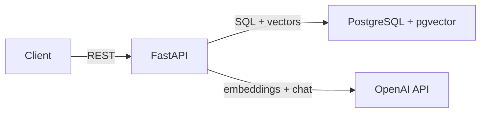

# Architecture

## Overview
A FastAPI application implementing RAG over user-uploaded PDFs. Documents are chunked and embedded on upload, then retrieved via vector similarity search at query time to ground LLM-generated answers (per FR-01, FR-02).

## System Design


## Components

### API Layer
- **Purpose**: HTTP interface for document and chat operations
- **Responsibilities**: Request validation, routing, response formatting
- **Interface**: REST endpoints under `/api/v1/`:
  - `POST /api/v1/documents` — accepts multipart file upload, returns `{id, filename, chunk_count}`
  - `GET /api/v1/documents` — returns `[{id, filename, uploaded_at, chunk_count}]`
  - `DELETE /api/v1/documents/{id}` — returns 200 or 404
  - `POST /api/v1/chat` — accepts `{message: str}`, returns `{answer: str, sources: [{content, document_id}]}`
- **Requirements satisfied**: FR-01, FR-02, FR-03, FR-04, NFR-04

### Document Ingestion Service
- **Purpose**: Process uploaded PDFs into searchable chunks
- **Responsibilities**: Extract text from PDF, split into fixed-size chunks with overlap, generate embeddings via OpenAI, store chunks and vectors
- **Interface**: Takes an uploaded file, returns the created document with chunk_count. Caller can depend on: document is persisted with all chunks and embeddings before return.
- **Requirements satisfied**: FR-01, NFR-01

### Retrieval Service
- **Purpose**: Find relevant document chunks for a query
- **Responsibilities**: Embed the query, perform vector similarity search against pgvector, return top-k chunks
- **Interface**: Takes a query string, returns ranked chunks. Each chunk has: content, document_id, similarity score. Sorted by relevance descending.
- **Requirements satisfied**: FR-02, FR-06, NFR-02

### Chat Service
- **Purpose**: Generate answers grounded in retrieved chunks
- **Responsibilities**: Build a prompt with retrieved chunks as context, call OpenAI chat completion, format response with source references
- **Interface**: Takes a message and retrieved chunks, returns an answer with source references (chunk content + document_id). When given no chunks, returns a "no information" response instead of hallucinating.
- **Requirements satisfied**: FR-02, FR-05, FR-06

## Data Flow

1. **Document upload**: Client sends PDF to API → Ingestion Service extracts text → splits into chunks → calls OpenAI embeddings API → stores document, chunks, and vectors in PostgreSQL
2. **Chat query**: Client sends message to API → Retrieval Service embeds the query → searches pgvector for top-k similar chunks → Chat Service builds prompt with chunks → calls OpenAI chat completion → returns answer with source chunk references

## Key Technical Decisions
- **pgvector over dedicated vector DB**: Keeps the stack simple — one database for both relational data and vectors. Sufficient for the scale described in NFR-01/NFR-02. Alternative: Pinecone or Weaviate (rejected — adds external dependency, violates NFR-03)
- **Fixed-size chunking**: Simple and predictable. 500 tokens with 50 token overlap per REQUIREMENTS.md assumptions. Alternative: semantic chunking (rejected — added complexity, out of scope)
- **text-embedding-3-small**: Good balance of quality and cost for this use case. 1536 dimensions. Resolves the open question in requirements.
- **5 chunks per query**: Enough context for grounded answers without exceeding context limits. Resolves the open question in requirements.

## File & Folder Structure
```
rag-api/
├── app/
│   ├── main.py              # FastAPI app, lifespan, router mounting
│   ├── config.py            # Settings via pydantic-settings
│   ├── database.py          # SQLAlchemy async engine and session
│   ├── models/
│   │   ├── document.py      # Document and Chunk SQLAlchemy models
│   ├── schemas/
│   │   ├── documents.py     # Pydantic request/response schemas
│   │   ├── chat.py          # Chat request/response schemas
│   ├── routers/
│   │   ├── documents.py     # Document CRUD endpoints
│   │   ├── chat.py          # Chat endpoint
│   ├── services/
│   │   ├── ingestion.py     # PDF processing, chunking, embedding
│   │   ├── retrieval.py     # Vector similarity search
│   │   ├── chat.py          # Prompt building, LLM call
├── tests/
│   ├── test_documents.py
│   ├── test_chat.py
├── docker-compose.yml
├── Dockerfile
├── pyproject.toml
└── README.md
```

## Testing Strategy
- **Unit tests**: Chunking logic, prompt building, response formatting
- **Integration tests**: Full endpoint tests using a test database with pgvector, mocked OpenAI API calls
- **Test runner**: pytest with httpx AsyncClient for FastAPI testing

## Assumptions
- [ASSUMED] text-embedding-3-small (1536 dimensions) is sufficient for this use case
- [ASSUMED] 5 chunks retrieved per query provides adequate context
- [ASSUMED] PyPDF2 or pdfplumber for PDF text extraction

## Open Questions
- [TBD] Whether to add a health check endpoint — low effort, useful for Docker Compose healthchecks
